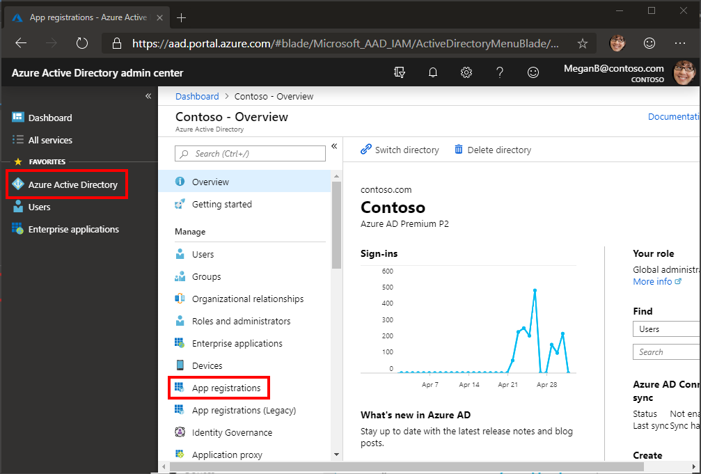
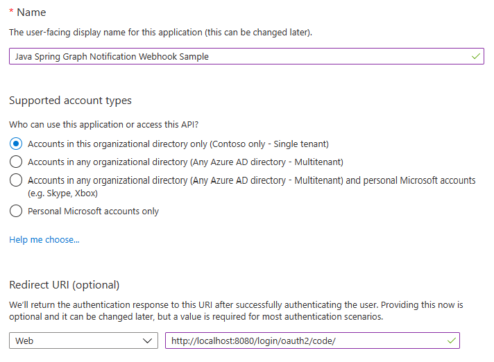
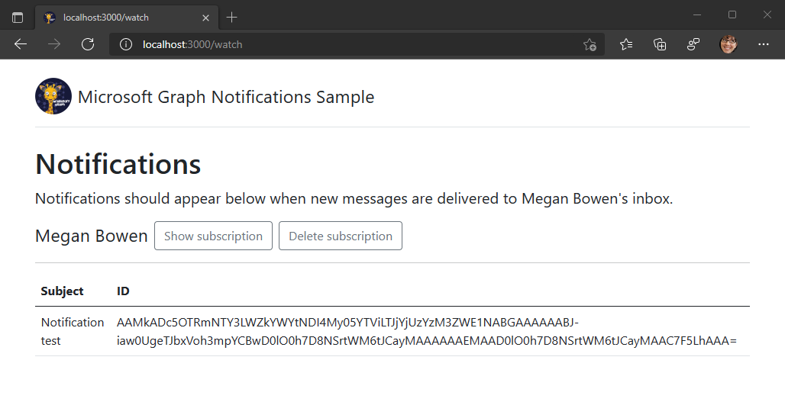

# Microsoft Graph Change Notifications Sample for Java Spring


## Use this sample application to receive Change Notifications with Resource Data

### Prerequisites

- A tenant administrator account on a Microsoft 365 tenant. You can get a development tenant for free by joining the [Microsoft 365 Developer Program](https://developer.microsoft.com/microsoft-365/dev-program).
- [Visual Studio Code](https://code.visualstudio.com/)
- [ngrok](https://ngrok.com/).
- [JDK14](https://docs.oracle.com/en/java/javase/14/install/)
- [Maven](https://maven.apache.org/).

### How the sample application works

The sample has the following features:

- The user can sign in with their Microsoft 365 work account and subscribe to notifications on their Exchange Online inbox. This demonstrates how to use delegated authentication to subscribe for change notifications on a user's behalf.
- The user can subscribe to notifications for all new Teams channel messages. This demonstrates how to use app-only authentication to subscribe for change notifications, and how to create a subscription that includes resource data.
- Received notifications are displayed in the app.

## Setting up the sample

1. Register a Microsoft Identity platform application, and give it the right permissions.
1. Update application.yml with information from the previous step

### Register a Microsoft Identity platform application

#### Choose the tenant where you want to create your app

1. Sign in to the [Azure Active Directory admin center](https://aad.portal.azure.com) using either a work or school account.
1. If your account is present in more than one Azure AD tenant:
    1. Select your profile from the menu on the top right corner of the page, and then **Switch directory**.
    1. Change your session to the Azure AD tenant where you want to create your application.

#### Register the app

1. Select **Azure Active Directory** in the left-hand navigation, then select [App registrations](https://go.microsoft.com/fwlink/?linkid=2083908) under **Manage**.

    

1. Select **New registration**. On the **Register an application** page, set the values as follows.

    - Set **Name** to `Java Spring Graph Notification Webhook Sample`.
    - Set **Supported account types** to **Accounts in this organizational directory only**.
    - Under **Redirect URI**, set the first drop-down to `Web` and set the value to `http://localhost:8080/login/oauth2/code/`.

    

1. Select **Register** to create the app. On the app's **Overview** page, copy the value of the **Application (client) ID** and **Directory (tenant) ID** and save them for later.

1. Select **Certificates & secrets** under **Manage**. Select the **New client secret** button. Enter a value in **Description** and select one of the options for **Expires** and select **Add**.

1. Copy the **Value** of the new secret **before** you leave this page. It will never be displayed again. Save the value for later.

    

1. Select **API permissions** under **Manage**.

1. In the list of pages for the app, select **API permissions**, then select **Add a permission**.

1. Make sure that the **Microsoft APIs** tab is selected, then select **Microsoft Graph**.

1. Select **Application permissions**, then find and enable the **ChannelMessage.Read.All** permission. Select **Add permissions** to add the enabled permission.

    > **Note:** To create subscriptions for other resources you need to select different permissions as documented [here](https://docs.microsoft.com/graph/api/subscription-post-subscriptions#permissions)

1. In the **Configured permissions** list, select the ellipses (`...`) in the **User.Read** row, and select **Remove permission**. The **User.Read** permission will be requested dynamically as part of the user sign-in process.

    

1. Select **Grant admin consent for `name of your organization`** and **Yes**. This grants consent to the permissions of the application registration you just created to the current organization.

### Generate the self-signed certificate

This step is required for the app-only Teams channel message subscription. Because this subscription requests notification with resource data, Microsoft Graph will encrypt the payload. As the payload is encrypted, it requires a certificate to ensure only you will be able to decrypt the payload. To generate a self-signed certificate run the following command from the sample folder. After running the command a file named `JKSkeystore.jks` should appear at the root of the repository.

```shell
keytool -genkey -keyalg RSA -alias selfsignedjks -keystore JKSkeystore.jks -validity 365 -keysize 2048
```

**Note:** this command will request a password to protect the keystore, write it down, you'll need it later.

### Update application.yml

1. Rename the [application.example.yml](graphwebhook/src/main/resources/application.example.yml) file to `application.yml`. Open the file in Visual Studio code or any text editor.

1. Update the following values.

    - `tenant-id`: set to the tenant ID from your app registration
    - `client-id`: set to the client ID from your app registration
    - `client-secret`: set to the client secret from your app registration
    - `storepass`: set to the password for your keystore

### Set up the ngrok proxy (optional)

You must expose a public HTTPS endpoint to create a subscription and receive notifications from Microsoft Graph. While testing, you can use ngrok to temporarily allow messages from Microsoft Graph to tunnel to a *localhost* port on your computer.

You can use the ngrok web interface `http://127.0.0.1:4040` to inspect the HTTP traffic that passes through the tunnel. To download and learn more about using ngrok, see the [ngrok website](https://ngrok.com/).

1. Run the following command in your command-line interface (CLI) to start an ngrok session.

    ```Shell
    ngrok http 8080
    ```

1. Copy the HTTPS URL that's shown in the console.

    

    > **IMPORTANT**: Keep the console open while testing. If you close it, the tunnel also closes and you'll need to generate a new URL and update the sample. See [troubleshooting](./TROUBLESHOOTING.md) for more information about using tunnels.

1. Update `host` in `application.yml` with the URL.

### Start the application

Open the repository with Visual Studio Code. Press F5.

Alternatively if you are not using Visual Studio Code, from the root of the repository:

```shell
mvn install
mvn package
java -jar target/rest-service-0.0.1-SNAPSHOT.jar
```

### Use the app to create a subscription

#### Use delegated authentication to subscribe to a user's inbox

1. Choose the **Sign in and subscribe** button and sign in with a work or school account.

1. Review and consent to the requested permissions. The subscription is created and you are redirected to a page displaying any notification being received.

1. Send an email to yourself. A notification appears showing the subject and message ID.

    

#### Use app-only authentication to subscribe to Teams channel messages

1. If you previously subscribed to a user's inbox, choose the **Delete subscription** button to return to the home page.

1. Choose the **Subscribe** button. The subscription is created and you are redirected to a page displaying any notification being received.

1. Post a message to a channel in any team in Microsoft Teams. A notification appears showing the sender's name and the message.

    

## Troubleshooting

See the dedicated [troubleshooting page](./TROUBLESHOOTING.md).

## Contributing

If you'd like to contribute to this sample, see [CONTRIBUTING.MD](./CONTRIBUTING.md).

This project has adopted the [Microsoft Open Source Code of Conduct](https://opensource.microsoft.com/codeofconduct/). For more information see the [Code of Conduct FAQ](https://opensource.microsoft.com/codeofconduct/faq/) or contact [opencode@microsoft.com](mailto:opencode@microsoft.com) with any additional questions or comments.

## Questions and comments

We'd love to get your feedback about the Microsoft Graph Webhooks sample for Java Spring. You can send your questions and suggestions to us in the [Issues](https://github.com/microsoftgraph/java-spring-webhooks-sample/issues) section of this repository.

Questions about Microsoft Graph in general should be posted to [Microsoft Q&A](https://docs.microsoft.com/answers/products/graph). Make sure that your questions or comments are tagged with the relevant Microsoft Graph tag.

## Additional resources

- [Microsoft Graph Webhooks sample for Node.js](https://github.com/microsoftgraph/nodejs-webhooks-rest-sample)
- [Microsoft Graph Webhooks sample for ASP.NET core](https://github.com/microsoftgraph/aspnetcore-webhooks-sample)
- [Working with Webhooks in Microsoft Graph](https://docs.microsoft.com/graph/api/resources/webhooks)
- [Subscription resource](https://docs.microsoft.com/graph/api/resources/subscription)
- [Microsoft Graph documentation](https://docs.microsoft.com/graph)
